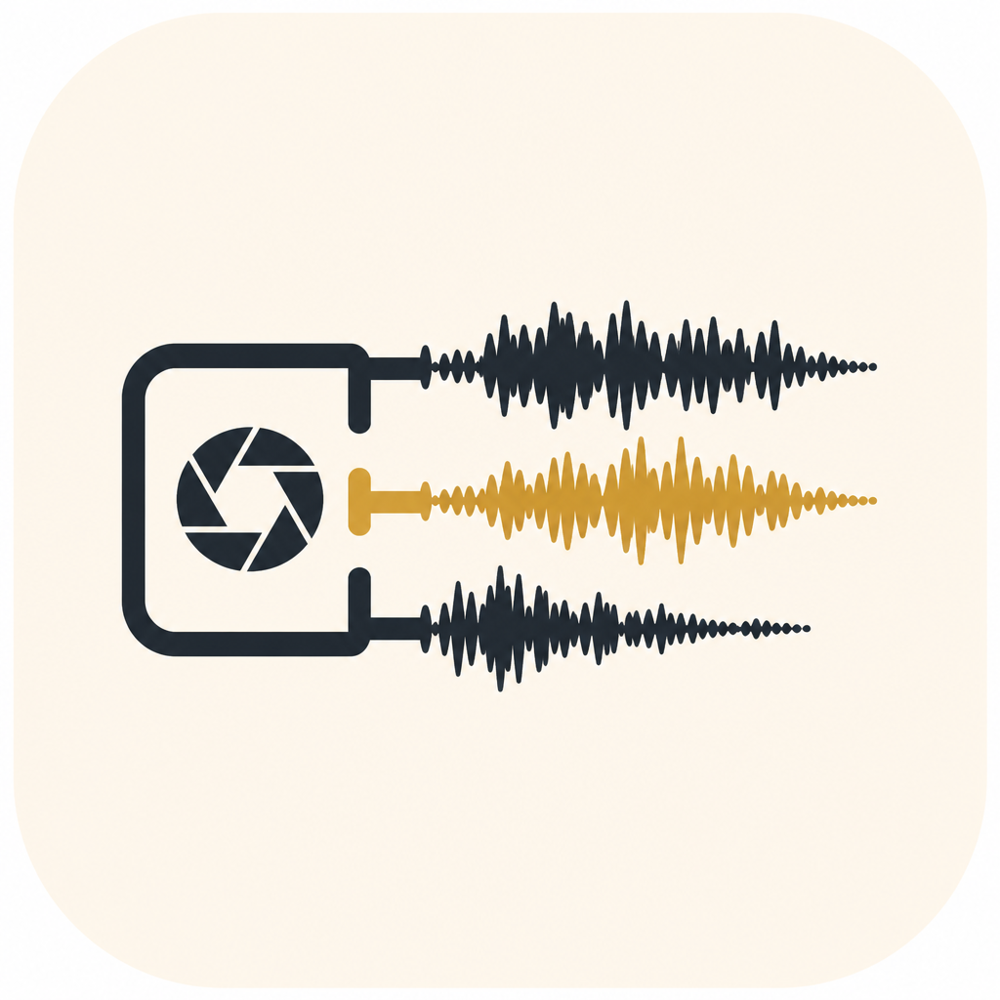

# Stem Recorder

Cross-platform desktop app that records **screen**, **camera**, and **microphone** as **separate stems** in one take folder.



```
Movies/stem-recorder/
  take-2026-08-14T20-03-09/
    screen.mp4
    cam.mp4
    audio.mp3
    manifest.txt
```

Capture uses the browser MediaRecorder (usually WebM), then **ffmpeg** transcodes to **mp4** (H.264) and **mp3** (LAME). Requires `ffmpeg` on your PATH (Homebrew: `brew install ffmpeg`).

MIT licensed.

## Quick start

```bash
git clone https://github.com/babacarcissedia/stem-recorder.git
cd stem-recorder
npm install
npm start
```

1. Pick camera + mic  
2. Pick screen / window  
3. **Record** → **Stop**  
4. Folder opens with `screen.mp4` · `cam.mp4` · `audio.mp3`

## Formats

| Stem | Output | Notes |
|---|---|---|
| Screen | `screen.mp4` | H.264, no audio |
| Camera | `cam.mp4` | H.264, no audio |
| Mic | `audio.mp3` | 192 kbps MP3 |

If ffmpeg is missing, raw `.webm` files are kept so the take is not lost.

## ffmpeg CLI fallback

```bash
./dual-record.sh list
./dual-record.sh start
./dual-record.sh stop
```

## License

MIT — see [LICENSE](LICENSE).
